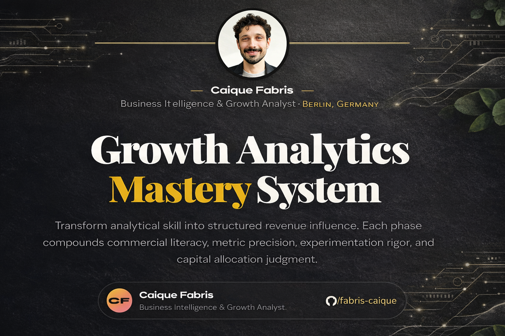

  

# Growth Analytics Mastery System

A structured 5-phase roadmap for developing capital-efficient Growth Analytics thinking — from unit economics to marginal ROI allocation.

**Live version:**  
https://fabriscaique.github.io/growth_analytics_mastery_system/

---

## Why This Exists

Most analysts learn tools.

Few learn how revenue systems actually work.

This framework is designed to bridge that gap — moving from metric reporting to capital allocation thinking.

The objective is not dashboard fluency.

The objective is becoming a revenue decision partner.

---

## The 5 Phases

### 1. Business Foundations

Unit economics, pricing models, cost structure, contribution margin, break-even analysis, competitive positioning.

You cannot optimize what you do not commercially understand.

---

### 2. Core Growth Metrics

CAC (blended and channel), LTV (retention-based and expansion-based), churn, NRR, payback period, MRR/ARR movement.

These metrics define capital efficiency.

---

### 3. Behavioral & Funnel Systems

AARRR framework, cohort retention, decay modeling, segmentation, RFM, churn predictors, A/B testing discipline.

Growth compounds through retention, not acquisition volume alone.

---

### 4. Technical Execution

SQL (CTEs, cohort queries, date spines), Python (Pandas, NumPy), visualization, statistical testing, automation, scenario modeling.

Execution converts theory into operational leverage.

---

### 5. Strategic Growth Thinking

ICE/RICE prioritization, OKRs, marginal ROI analysis, diminishing returns modeling, budget reallocation logic, insight-first storytelling.

This is where analytics becomes strategy.

---

## What This Builds

- Commercial literacy  
- Capital allocation discipline  
- Retention-first thinking  
- Experimentation rigor  
- Scenario modeling capability  
- Executive-level communication clarity  

---

## Intended Audience

- BI Analysts moving toward Growth roles  
- Product Analysts seeking commercial depth  
- Founders building data-driven decision systems  
- Analysts preparing for senior-level interviews  

---

## Philosophy

Growth is not traffic.

Growth is efficient capital deployment under uncertainty.

Metrics are not the goal.  
Capital efficiency is.

---

## Author

**Caique Fabris**  
BI & Growth Analytics  
Berlin, Germany  

LinkedIn: https://linkedin.com/in/fabriscaique
